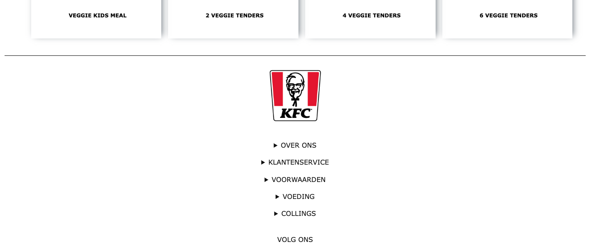

# Procesverslag
Markdown is een simpele manier om HTML te schrijven.  
Markdown cheat cheet: [Hulp bij het schrijven van Markdown](https://github.com/adam-p/markdown-here/wiki/Markdown-Cheatsheet).

Nb. De standaardstructuur en de spartaanse opmaak van de README.md zijn helemaal prima. Het gaat om de inhoud van je procesverslag. Besteedt de tijd voor pracht en praal aan je website.

Nb. Door *open* toe te voegen aan een *details* element kun je deze standaard open zetten. Fijn om dat steeds voor de relevante stuk(ken) te doen.

## Jij

  
uitwerken voor kick-off werkgroep

  ### Auteur:
  Guido van Sark

  #### Je startniveau:
  blauw

  #### Je focus:
  responsive
 

## Je website

  
uitwerken voor kick-off werkgroep

  ### Je opdracht:
  https://www.kfc.nl/
  ik ga mij focussen om het helemaal responsive te maken.

  #### Screenshot(s) van de eerste pagina (small screen): 
  homepage pagina
  

  #### Screenshot(s) van de tweede pagina (small screen):
  Deals pagina 
  
 

## Toegankelijkheidstest 1/2 (week 1)

  
uitwerken na test in 1e werkgroep

  ### Wie en wat?
  Test van de website: KFC
  Getest door Lynn Wolters
  Site is gekozen door Guido Van Sark

  ### Bevindingen
  Hieronder zie je een lijst van alle bevindingen die zijn gedaan.

  #### Screenreader
  Links: Alle linkjes doen het.

  Koppen: Meeste koppen doen het niet omdat het plaatjes zijn.

  Formulierregelaars: Doet het goed, de elementen waar je wat in kan vullen worden opgenoemd.

  Oriëntatiepunten: Doet het alleen op het logo en op de gehele body van de website, bij de rest wordt er niet verteld waar je bent.

  Navigatie: Doet het niet, leest navigatie items niet voor.

  Tekens: Doet het ook niet, bij geen enkel teken wordt er verteld wat het is.

  Woorden: Doet het niet, leest geen enkel woord voor.

  Vensterspots: Doet het niet, pakt geen enkel venster op de website.

  #### Muis en Toetsenbord 
  Muis: 
  Grote knoppen hebben geen hover
  Navigatiebar items hebben geen hover.
  Social media icons doen het niet onderaan de footer.

  Toetsenbord:
  Tab knop werkt goed om door alle elementen heen te gaan, het is alleen niet duidelijk hoe je ermee terug kan.
  Met de spatie balk kan je snel naar beneden, het is niet duidelijk hoe je omhoog gaat.
  Met de omhoog en omlaag knopjes kan je scrollen.

  Kleurtjes:
  Je kan van alles nog zien wat het is, wel wordt het eten soms minder lekker door de kleur die het krijgt.

  #### Motoriek (shocks, elastiekjes)
  Spieren Apparaat:
  De website is (als je je focust) goed te gebruiken, wel zijn sommige items te klein (knoppen, links), waardoor het moeilijk wordt om er op te klikken.

  Concentratie test:
  Website is goed te besturen.

  #### Visueel (brillen, contrast, kleurenblind, dark/light). 
  Brillen:
  Hemifield Loss: alles is nog goed te zien.
  Color #0779P: alles is nog goed te zien.
  Peripheral Field Loss: de tekst is te klein om te lezen en de plaatjes zijn te groot om in een oogopslag te kunnen zien.
  Central Field Loss: alles is nog goed te zien.
  Low Contrast #0778P: alles is redelijk goed te zien, de tekst kleur kan anders omdat die teveel vervaagt.
  Combined Loss Diabetic Disease: alles is nog goed te zien.

## Breakdownschets (week 1)

  
uitwerken na afloop 2e werkgroep

  ### de hele pagina van homepage: 
  

  ### de hele pagina van deals: 
  

## Voortgang 1 (week 2)

  
uitwerken voor 1e voortgang

  ### Stand van zaken
  Ik heb veel gehad aan de oefeningen dit heeft mij veel hulp gebracht om te werken met teksten in afbeeldingen. Alleen ik had een vraag over hoe ik De h1 kon verbergen voor de gebruiker maar niet voor de screenreader? En hoe kan ik de button mee laten verschuiven met de afbeedling?

  

  ### Agenda voor meeting
  samen met je groepje opstellen

  student 1: Guido: 
  Vraag1: Hoe verberg je de H1 voor de gebruiker en dat de screenreader hem wel kan lezen?
  Vraag2: Hoe laat je de buttons mee schuiven met de afbeelding? 

  student 2: Chloe: 
  Vraag1: Hoe kan je de navigatiebar hergroeperen als de site groter wordt?

  student 3: Lynn: 
  Vraag1: Wat is de beste manier om sliders in je site te implenteren die responsive ook goed werken?
  
  ### Verslag van meeting
  hier na afloop snel de uitkomsten van de meeting vastleggen

  - punt 1: Als je je website inspecteert moet je nooit je telefoon aanzetten in de inspecter.
  - punt 2: Probeer de elementen te benoemen met nth-of-type niet met classes.
  - Punt 3: Nier meer dan 1 H1 gebruiken op je website. 
  - Punt 4: Om ervoor te zorgen dat de H1 verborgen is voor de gebruiker kun je met position:fixed, left:-9999em en top:0. Zo is hij helemaal links weggestopt.
  - Punt 4: Schrijf een nette html waar alles goed en duidelijk onder elkaar staat.
  - Punt 5: Van alle buttons een link maken met de a.
  - Punt 6: Door te werken met Position: fixed. kun je een afbeedling op de juiste plek zetten dit geldt ook voor een button.

## Voortgang 2 (week 3)

  
uitwerken voor 2e voortgang

  ### Stand van zaken
  Ik ben verder gekomen met mijn website en heb hulp kunnen krijgen van de student assistent. Ik had nog wel een vraag over hoe ik een menu vast kan zetten aan de bovenkant van je scherm zodat hij als je scrollt mee gaat?

  ### Agenda voor meeting
  samen met je groepje opstellen

  student 1: Guido: 
  Vraag1: Hoe kun je een blok vastzetten terwijl je scrollt?

  student 2: Chloe: 
  Vraag1: Hoe blijft de content dezelfde grootte als je de pagina vergroot en verkleint? 
  Vraag2: Hoe kun je caroussel pijltjes maken waar je op kunt klikken en navigeren?

  student 3: Lynn: 
  Vraag1: Hoe maak je een button in de slider die ervoor zorgt dat je een andere kleur kunt selecteren?

  ### Verslag van meeting
  hier na afloop snel de uitkomsten van de meeting vastleggen
  Ik was niet aanwezig bij deze meeting, maar heb wel te horen gekregen van mijn team wat ze hebben besproken.

  - punt 1: Geef de buttons een bepaalde style om ervoor te zorgen dat images hier geen effect op hebben 
  - punt 2: Antwoord gekregen hoe je bepaalde dingen positioneert. Dit doe je met position: static, relative, fixed, absolute en sticky.
  - Punt 3: Om caroussel pijltjes te maken moet je met javascript gaan werken.
  - Punt 4: Als je de pagina responsive wil houden kun je werken met initial-scale. Zo schaalt de content mee.
  - Punt 5: Met position: sticky kun je het element boven aan de pagina vast zetten terwijl je scrolt.

## Toegankelijkheidstest 2/2 (week 4)

  
uitwerken na test in 8e werkgroep

  ### Wie en wat?
  Het Testen van de zeflgemaakte website KFC.
  Getest door Guido van Sark
  Site is gekozen door Guido Van Sark

  ### Bevindingen
  Lijst met je bevindingen die in de test naar voren kwamen (geef ook aan wat er verbeterd is):

  #### Screenreader
  Alle links doen het van de site dit lijkt goed te werken. Je navigeert gemakelijk van 
  link tot link. 

  De meeste koppen worden uitgesproken door de screenreader alleen op het scherm wordt je 
  niet gelijkt naar waar hij op dat moment zich bevindt.

  Formulierregelaars: De hij gaat alle elementen af en laat zien of je het iets wilt 
  invullen of een lijst wilt uitvouwen. 

  Oriëntatiepunten: Hij laat zien dat je ons kunt volgen en dat je op de link kan drukken 
  van de appstore. Bij de rest wordt er niet verteld waar je je bevindt op de site.

  Navigatie: Hij vertelt dat je aan het begin bent van de navigatie. Hij toont alle items 
  die zich in dit veld bevinden. Bij het laatste onderdeel verteld hij dat je aan het 
  einde van de naviagtie bent.

  Tekens: Hij verteld bij elk item wat het is en wat voor teken het dus is.

  Woorden: Hij leest alle worden voor, ook de worden die je niet ziet op de site zelf. 
  deze zijn verborgen voor de gebruiker.

  Vensterspots: Hij laat alleen de koppen zien als vensterspot.

  #### Muis en Toetsenbord 
  Muis: 
  Alle items hebben een duidelijke hover. Ze laten zien bij welk item je je bevindt.

  Toetsenbord:
  Met de Tab knop kun je gemakkelijk alle elementen langs gaan. Het niet duidelijk hoe je 
  terug navigeert naar je vorige tab optie.
  De optie met de pijltjes toesten voor omhoog en omlaag scrollen werkt.
  Met de spatie balk kun je snel naar beneden scrollen.
  Met de enter knop kun je goedkeuren waar je wilt heen navigeren.

  Kleurtjes:
  Met de tool colorblindly kun je kijken wat voor effect het heeft op mensen die dit 
  hebben. Alleen geen enkel effect lijkt te werken op mijn site. 

  #### Motoriek (shocks, elastiekjes)
  Ik kon de Motoriek test niet uitvoeren. Ik heb deze les gemist en had de middelen niet 
  om dit te doen, maar ik heb zelf de mijn site getest op de screereader en muis en 
  toetsenbord. Zie hierboven.

  #### Visueel (brillen, contrast, kleurenblind, dark/light). 
  Ik kon de Visueel test niet uitvoeren. Ik heb deze les gemist en had de middelen niet om 
  dit te doen, maar ik heb zelf de mijn site getest op de screereader en muis en 
  toetsenbord. Zie hierboven.

## Voortgang 3 (week 4)

  
uitwerken voor 3e voortgang

  ### Stand van zaken
  Na het werken aan de eerste website heb ik deze nu afgerond en ben ik begonnen aan mijn tweede website. Ik heb veel kunnen vragen aan de student assistenten, maar ik had nog een vraag. Hoe kan ik ervoor zorgen dat een afbeeldingen en een teskt in een zeflde grid column zitten?

  ### Agenda voor meeting
  samen met je groepje opstellen

  student 1: Guido: 
  Vraag1: Hoe kan ik ervoor zorgen dat een afbeeldingen en een teskt in een zeflde grid column komen te zitten?

  student 2: Chloe: 
  Vraag1: Hoe kan je zonder javascript pijltjes maken in de slider?

  student 3: Lynn: 
  Vraag1: Hoe maak je de side navigatie op de product pagina?
  Vraag2: Hoe navigeer je door een slider met buttons?

  ### Verslag van meeting
  hier na afloop snel de uitkomsten van de meeting vastleggen

  - punt 1: Ik was @media vergeten toe te voegen aan mijn css. Hiermee kun je het grid aanpassen.
  - punt 2: Door pijltjes te maken in je slider moet je werken met javascript.
  - punt 3: Door het een min-width en  max-width te geven aan verschillende navigatie balken.
  - punt 4: Dit kun je weg werken met position:fixed, left:-9999em en top:0. 
  - punt 5: Ik moet bij elke html beginnen bij h1 en verder naar beneden tellen en niet een h3 overslaan.

  - ...

## Eindgesprek (week 5)

  
uitwerken voor eindgesprek

  ### Je uitkomst - karakteristiek screenshots:
  Hier zie je een Grid van 2 en 3 rijen als je de maat van de website verschuift dan sprinhgt het colom op een bepaald punt mee. Zo blijft het responsive.

  
  

  Hier zie je dat ik een grid heb gemaakt met daarin een scroll functie. Als de website kleiner is kun je door het assortiment scrollen. Ook zie je dat de navigatie blijft plakken als je naar beneden scrollt. Dit heb ik gedaan met position: sticky. 

  
    

  Hier zie je dat ik met javascript een darkmode en lightmode heb toegevoed aan de site. Ik vond dit wel lastig dus het enige wat veranderd is de achtergrond. Ik ben hier wel heel blij mee. Zo is het bereikbaar voor mensen die last hebben van velle kleuren. 

  
  

  Een van de eisen die bij het kopje responsive hoorde was het toevoegen van geluid. Ik heb met mijn eigen stem iets ingesproken, namelijk: its finger licking good. Dit heb ik gelinkt aan een afbeelding in de footer.

  

### Responsive: 
  Ik ben gegaan voor het maken van een website waarbij de website op meerdere aparaten te bereiken is.
  Ik heb naar mijn mening de Surface plane onderwerpen toegepast:
  Ik heb geluid toegvoegd aan mijn website.
  Ik heb een dark/light mode erin verwerkt.
  Er zit een Scroll animatie erin verwerkt.
  Er zit een Formulier in wat je kunt invullen.
  Er zit een Advanced positioning: Sticky in. Om je navigaite in beeld te houden.

  ### Dit ging goed/Heb ik geleerd: 
  In het begin wist ik niet hoe nou precies het grid werkte op een website. Na veel oefeningen te doen en vragen te stellen hierover ben ik zeer tevreden met het reslutaat. Ik weet nu hoe ik een grid moet gebruiken als je allerlei afbeedlingen naast in een colom wilt hebben.

  

  ### Dit was lastig/Is niet gelukt:
  De Kfc website heeft onderaan bij de footer een uitklapbaar stuk om zo op een kleiner scherm minder content te weergeven. Als je dit vergoot gaat dit uitklapbaar element weg en zie je alle content. Alleen ik kwam hier niet uit. Het lukte mij niet om alle content op een groot scherm te weergeven. De content zit in een uitklapbaar venster. Ik kwam hier niet uit en het lukte mij niet om dit stuk responsive te maken.

  

## Bronnenlijst

  
continu bijhouden terwijl je werkt

  Nb. Wees specifiek ('css-tricks' als bron is bijv. niet specifiek genoeg).

  1. bron 1: Sanders, H. (z.d.). KFC - nederlands lekkerste verse kip. KFC. Geraadpleegd op 13 december 2022, van https://www.kfc.nl/
  2. bron 2: Simple dark mode toggle with css variables. Grizhlie. (z.d.). https://codepen.io/. Geraadpleegd op 13 december 2022, van https://codepen.io/grizhlie/pen/WNpbNBX
  3. ...

